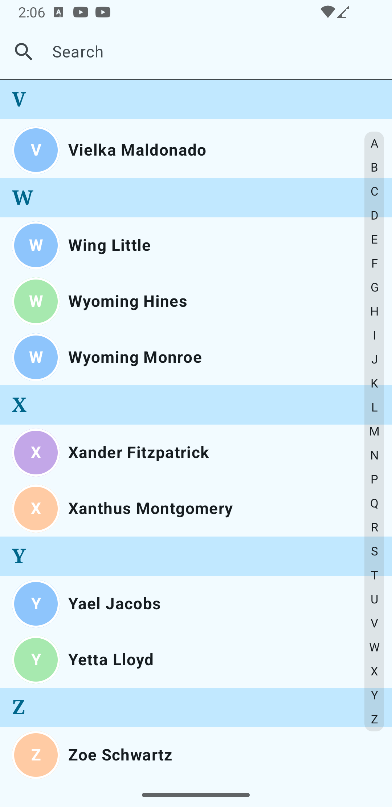

# Contact App
An Android native app created for personal practice. This project is designed to explore and implement:
- **MVI Architecture** for state management and separation of concerns.
- **ContentProvider** to query and display contact details.
- **Jetpack Compose** for modern UI development.

## Features
- Display a list of contacts with name and profile picture.
- Debounced search functionality.
- Bottom sheet UI to display selected contact details.
- Contact Index Navigation for quick access.

## Screenshots
| Screenshot 1 | Screenshot 2 |
|-------------|-------------|
|  | |

## License
This project is for personal practice and learning purposes. Feel free to fork and modify as needed.

---
### Contributions
This is a personal project, but feedback and suggestions are always welcome!

